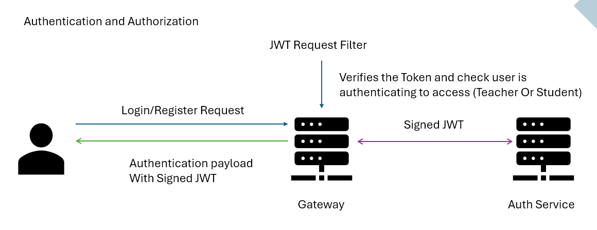

# Learning Management System (LMS) based on Microservices

## Introduction
The Learning Management System (LMS) is designed to provide a scalable and efficient platform for managing educational content, user authentication, file uploads, quizzes, and quiz grading. The core features include class management, authentication using JWT tokens, file uploads, and quiz services. The overall goal of the application is to streamline educational processes and enhance the learning experience through a modular and microservices-based architecture.

## Architecture

### Architectural Diagram


### Design Decisions
The application is divided into multiple microservices to ensure scalability, maintainability, and ease of development. Each service is responsible for a specific domain of the LMS, contributing to the overall functionality:
- **Class Service**: Manages class-related operations.
- **Authentication Service**: Handles user authentication and JWT token management.
- **File Upload Service**: Manages file uploads.
- **Quiz Service**: Manages quiz creation.
- **Grading Service*: Evaluate and grade quizzes

## Microservices

### Implementation Methods
The microservices are implemented using the Netflix software stack, specifically utilizing Netflix Eureka for service discovery and Spring Cloud Gateway for API routing and gateway functionality.

### Core Services

### Class Service
- **Functionality**: Manages class-related operations.
- **REST API Endpoints**:
  ```http
  GET /classes/{classid}                 # Get single class details
  POST /classes                         # Create class and randomly generate a join code
  GET /classes/teachers/{teacherid}     # Get all classes of single teacher
  GET /classes/students/{studentid}     # Get all classes of a student
  DELETE /classes/{classid}             # Delete a class by teacher
  DELETE /classes/student/leave/{classid} # Leave from class by student
  DELETE /classes/teachers/remove/{classid}/{studentid} # Remove from the class by teacher
  POST /classes/teachers/students/{classid} # Add student to class by email
  POST /classes/student/join/{classid}  # Join a class using join code
  POST /auth/register                   # Register for application
  POST /auth/login                      # Login user
- **Inter-service interactions**: Consumes authentication service for verifying user access.

#### Authentication Service
- **Functionality**: Manages user authentication and JWT tokens.
- **REST API Endpoints**:
  - `POST /auth/login`: User login.
  - `POST /auth/register`: User registration.
  - JWT validation is attached to API gatway server as a request filter.
- **Inter-service interactions**: Provides JWT validation for other services.
- 

#### File Upload Service
- **Functionality**: Manages file uploads.
- **REST API Endpoints**:
  - `POST /files/upload`: Upload a file.
  - `GET /files/{id}`: Retrieve a file by ID.
  - `DELETE /files/{id}`: Delete a file by ID.
  - `GET /files`: List all files.
- **Inter-service interactions**: Provides file access to class and quiz services.

#### Quiz Service
- **Functionality**: Manages quizzes and grading.
- **REST API Endpoints**:
  - `GET /quizzes`: Retrieve all quizzes.
  - `POST /quizzes`: Create a new quiz.
  - `GET /quizzes/{id}`: Retrieve a specific quiz by ID.
  - `POST /quizzes/{id}/grade`: Grade a quiz submission.
- **Inter-service interactions**: Consumes file upload service for quiz resources.

### Discovery Server
The services register with the Netflix Eureka discovery server, which monitors and maintains a registry of available services. Each service registers upon startup and periodically sends heartbeat signals to the server to indicate its health status.

### API Gateway
The Spring Cloud Gateway serves as the API gateway, routing requests to the appropriate services based on predefined configurations. It handles cross-cutting concerns such as security, rate limiting, and load balancing.

###Interservice Communications are done using Rest Templates ex:
ResponseEntity<Map> response = restTemplate.exchange(
    "http://auth-service/auth/user/sid/" + sid, 
    HttpMethod.GET, 
    null, 
    Map.class
);
## User Interface

### Implementation Details
The user interface is implemented using React,Redux and RTKquery providing a responsive and interactive experience for users. It communicates with the backend microservices through the API gateway to perform various operations such as class management, user authentication, file uploads and quiz interactions.

### API Testing Tools
API testing tools like Postman are used to test the application's APIs. Each endpoint is tested for functionality, performance, and security to ensure robust and reliable services.

## Deployment

### Local Deployment
1. Clone the repository: `git clone https://github.com/yourusername/lms-microservices.git](https://github.com/Yasodhyassp30/LMS--with-Microservices)`
3. Start each service:
   - For Spring Boot services: `./mvnw spring-boot:run`
   - For FastAPI services: `uvicorn main:app --reload`
   - For Node.js services: `npm start`
4. Start the Eureka discovery server and API gateway.

## Development Challenges
During the development period, several challenges were faced, including:
- **Inter-service communication**: Ensuring seamless communication between services required careful design of API contracts and error handling mechanisms.
- **Scalability**: Designing the system to handle increasing loads involved optimizing service performance and implementing load balancing strategies.
- **Security**: Implementing secure authentication and authorization mechanisms to protect user data and service integrity.

These challenges were overcome through iterative development, extensive testing, and leveraging the capabilities of the Netflix software stack and Spring Cloud ecosystem.
